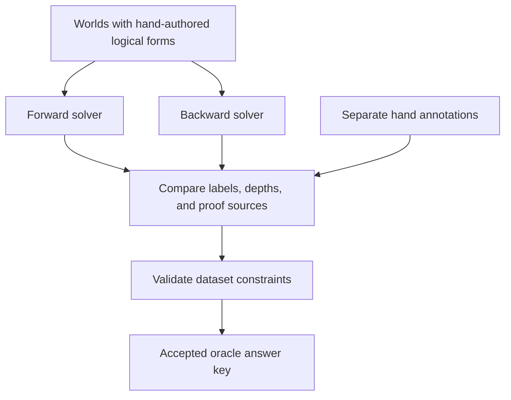
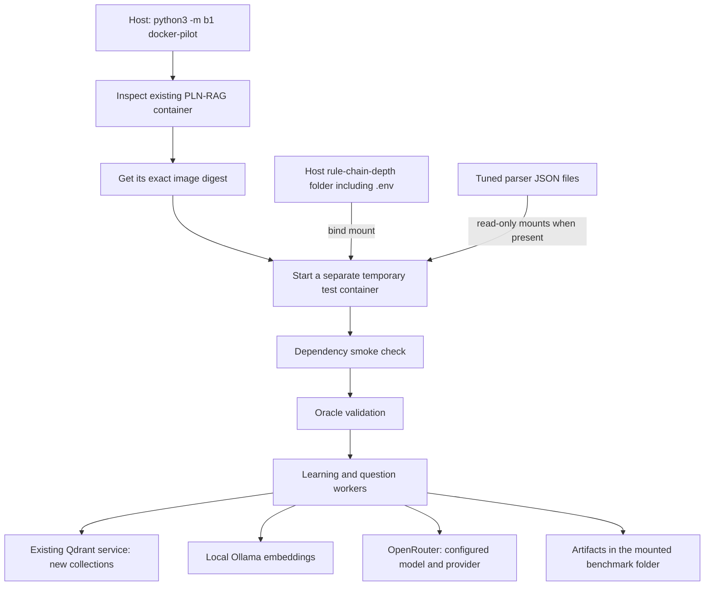

# Understanding rule-chain-depth

This guide explains the project as it is implemented on **7 October 2026**: what it measures, where the LLM is used, how Docker receives the API key, what each project file does, and what you can change.

The shared **40-question comparison is now implemented**. This guide's detailed walkthrough uses the original eight-world pilot. Read [RUNNING.md](RUNNING.md) for the new dataset, shared settings, and commands that run Docker PLN-RAG alongside host normal RAG and full context.

All terminal commands below assume your current directory is `rule-chain-depth`. The examples contain placeholder credentials, never a real API key.

## Contents

1. [What this project measures](#1-what-this-project-measures)
2. [What rule-chain depth means](#2-what-rule-chain-depth-means)
3. [The worlds and questions](#3-the-worlds-and-questions)
4. [How the correct answers are established](#4-how-the-correct-answers-are-established)
5. [Where the LLM is used](#5-where-the-llm-is-used)
6. [How one benchmark run works](#6-how-one-benchmark-run-works)
7. [How the Docker version works](#7-how-the-docker-version-works)
8. [How the API key reaches PLN-RAG](#8-how-the-api-key-reaches-pln-rag)
9. [Commands you can run](#9-commands-you-can-run)
10. [What each file does](#10-what-each-file-does)
11. [Settings you can tweak](#11-settings-you-can-tweak)
12. [Settings fixed by the worker](#12-settings-fixed-by-the-worker)
13. [Requests, quotas, and timing](#13-requests-quotas-and-timing)
14. [Reading the results](#14-reading-the-results)
15. [A real saved trial explained](#15-a-real-saved-trial-explained)
16. [Changing the dataset or extending the benchmark](#16-changing-the-dataset-or-extending-the-benchmark)
17. [Troubleshooting and a suggested reading order](#17-troubleshooting-and-a-suggested-reading-order)

## 1. What this project measures

The main question is:

> Can a system establish a claim when its supporting facts require zero, one, two, or three applications of rules?

Three folders have different jobs:

| Folder | Job |
| --- | --- |
| `rule-chain-depth/` | Defines the test worlds, computes the expected answers, runs PLN-RAG, and records what happened. |
| `../PLN-RAG/` | Implements the system being tested: English parsing, knowledge storage, logical inference, and answer generation. |
| `../normal-rag/` | Implements the separate three-world retrieval/full-context baseline pilot. |

The `pilot` and `docker-pilot` commands in **this** project run PLN-RAG only. The new `benchmark` command runs selected systems on identical questions: by default, all three systems on the 40-question dataset. It can also compare them on the original pilot with `--dataset pilot`.

There are two distinct uses of logic:

- **Benchmark oracle:** small Python solvers calculate the expected answer from hand-authored logical data.
- **PLN-RAG reasoner:** PeTTaChainer/PeTTa tries to prove the claim from atoms that PLN-RAG's LLM produced from English.

Comparing those results tests the complete PLN-RAG path, including parsing mistakes. It does not measure the logic engine in isolation.

## 2. What rule-chain depth means

Consider this illustrative world fragment:

```text
S01: Hana can sort a parcel.
S02: Everyone who can sort a parcel can check a label.
S03: Everyone who can check a label can pack a crate.
S04: Everyone who can pack a crate can seal a crate.
```

These IDs illustrate the explanation; the actual pilot shuffles sentences and assigns its own IDs.

| Claim | Reason | Depth |
| --- | --- | ---: |
| Hana can sort a parcel. | A stated fact. | 0 |
| Hana can check a label. | Apply S02 to S01. | 1 |
| Hana can pack a crate. | Apply S03 to the previous conclusion. | 2 |
| Hana can seal a crate. | Apply S04 to the previous conclusion. | 3 |

The general definition is:

```text
depth of a fact = 0
depth of a rule application = 1 + maximum depth of its premises
depth of a supported claim = minimum depth among its valid proofs
```

If a claim has both a direct fact and a three-rule proof, its depth is **0**. The oracle checks for these unintended shortcuts.

### Rules with more than one premise

A conjunction rule requires both premises. For example:

```text
Hana can sort a parcel.
Hana can check a label.
Everyone who can sort a parcel and can check a label can pack a crate.
```

Both premises are facts, so the result has depth `1 + max(0, 0) = 1`. You do not add the number of facts together. If the two premises instead have depths 2 and 1, the result has depth `1 + max(2, 1) = 3`.

Similarly, two relationship facts plus one composition rule can establish a relational claim at depth **1**. A relationship involving two people or two links does not automatically have depth 2.

### Claims with no proof

If the world cannot establish a claim, its label is `NOT_ESTABLISHED` and its actual depth is `null`.

This means that the available sentences do not prove it. It does not assert that the opposite claim is true.

An unsupported question can still have `depth_bucket: 2`. That describes its pairing with a supported depth-2 question. It is not a proof depth for the unsupported claim. The oracle also checks that adding its designated missing fact would make it provable at that depth.

## 3. The worlds and questions

The original pilot dataset has **8 worlds**, each containing **12 sentences** and **2 questions**:

- One supported target.
- One unsupported control.

That gives **16 questions** for the complete pilot.

The separate full dataset in `data/benchmark/` has **20 worlds and 40 questions**, with 150 fact entries and 90 rule entries. It has five supported/control pairs per depth bucket; the first four worlds visit depths 0, 1, 2, and 3. See [RUNNING.md](RUNNING.md) for its construction and selection rules.

| World | Supported question | Supported depth | Rule kind |
| --- | --- | ---: | --- |
| `pilot-01` | Can Hana sort a parcel? | 0 | Fact |
| `pilot-02` | Can Abebe check a label? | 1 | Chain |
| `pilot-03` | Can Selam pack a crate? | 2 | Chain |
| `pilot-04` | Can Aster seal a crate? | 3 | Chain |
| `pilot-05` | Can Hana pack a crate? | 1 | Conjunction |
| `pilot-06` | Can Hana seal a crate? | 3 | Conjunction |
| `pilot-07` | Can Hana train Abebe? | 1 | Relational |
| `pilot-08` | Can Hana lead a team? | 2 | Mixed |

`--world-limit 2` selects `pilot-01` and `pilot-02`, giving four questions. It does not sample two random worlds. To include depth 2, select at least three worlds; to include depth 3, select at least four.

The dataset keeps two representations of each sentence. For example, this is an actual rule from `pilot-01`:

```json
{
  "id": "S01",
  "text": "Everyone who can pack a crate can seal a crate.",
  "type": "rule",
  "head": {"predicate": "seal_crate", "arguments": ["?x"]},
  "body": [{"predicate": "pack_crate", "arguments": ["?x"]}]
}
```

`body` contains the premises; `head` is the conclusion. `?x` is a variable standing for a person. A fact has an empty `body` and names actual people instead of variables.

The oracle reads the logical representation. PLN-RAG is given the **English sentence**, with its ID available to the benchmark for tracking. The benchmark does not hand PLN-RAG the oracle's logical atoms or proof.

The frozen IDs use `S01`, `S02`, and so on. Keep them stable when interpreting a saved run: the same ID in another world refers to that other world's sentence.

## 4. How the correct answers are established

The answer key is checked without calling an LLM:



The **forward solver** starts with facts and repeatedly applies rules until it cannot add a useful new conclusion or proof. It joins premises consistently, so a fact about Hana cannot accidentally satisfy a premise about Meron.

The **backward solver** starts with the question's goal, looks for facts or rules that establish it, and recursively searches for the required premises. It detects cycles and handles variable assignments independently of the forward solver.

They must agree on their retained proof results. The oracle also compares the expected label, depth, and minimum-depth proof IDs with the separately authored annotations. A disagreement stops validation before the benchmark calls PLN-RAG.

The solvers retain alternative proofs. This matters because a claim can have more than one valid set of supporting sentences.

The oracle is a deliberately small positive-rule system. It supports predicates with one or two arguments, at most two premises per rule, and no arbitrary functions. It is not a general English reasoning engine or a probabilistic evaluator.

Even when running only two worlds, the runner validates the complete eight-world dataset before selecting that subset.

## 5. Where the LLM is used

| Operation | Uses an LLM? | What it does |
| --- | --- | --- |
| Author and validate the frozen worlds | No | Uses Python templates, logical forms, and independent solvers. |
| Compute expected labels and depths | No | Runs the benchmark's forward and backward solvers. |
| Produce embeddings | Uses a local embedding model | Ollama's `nomic-embed-text` turns text into vectors. No OpenRouter embedding call. |
| Parse English facts and rules in PLN-RAG | Yes | DSPy/NL2PLN asks the configured model to produce PLN atoms. |
| Parse a question in PLN-RAG | Yes | Produces a logical query from the English question. |
| Search for a PLN proof | No generative LLM call | PeTTaChainer/PeTTa performs logical inference. |
| Turn a found proof into an English answer | Yes | The answer generator uses the configured model. With no proof, its normal path returns a fixed abstention without this call. |
| Decide whether the result matches the oracle | No | Python compares the recorded system label with the expected label. |

The benchmark's `model.py` file defines Python data types. It does **not** contain a neural network or select the LLM.

PLN-RAG uses the same configured LLM for parsing and proof-to-answer generation. The benchmark installs an observed DSPy client after the upstream parser and service have been constructed, so the benchmark's model parameters apply to the actual run.

The system label comes from the returned proof payload, with observed errors taking precedence. An English answer that says “yes” cannot turn an empty proof into `SUPPORTED`.

## 6. How one benchmark run works

The main coordinator is [b1/pln_runner.py](b1/pln_runner.py). Each individual operation runs through [b1/pln_worker.py](b1/pln_worker.py).

1. **Validate the dataset.** Run both oracles and check the hand annotations.
2. **Choose the worlds.** Select the first N worlds, where N is `--world-limit`.
3. **Create a new run.** Assign a unique run ID, save configuration and source hashes, and prepare the request-budget file.
4. **Connect to Qdrant.** Use the configured service, or start the private local binary when using the local default URL and the binary is available.
5. **Learn one world in a fresh worker.** Supply each English sentence to PLN-RAG, recording its returned atoms, parse status, timing, and model requests.
6. **Save the learned state.** Copy the resulting atomspace into a snapshot and record its SHA-256 hash—a fingerprint of the file's bytes.
7. **Ask the supported question in a fresh worker.** Verify and restore the snapshot, then execute PLN-RAG's query path.
8. **Ask the control in another fresh worker.** Restore the same snapshot again, so changes caused by the first query do not become knowledge for the second.
9. **Record and compare.** Save the proof, answer, timings, errors, source diagnostics, and correctness against the oracle.
10. **Continue or stop.** Move to the next world unless learning/runtime failure requires stopping. Save the final review gate.

Each world has a unique vector collection for that run. The supported and control questions read that world's collection, without adding query vectors to it. They use separate atomspace working copies.

The runner observes upstream behavior; it does not replace a wrong PLN parse with the oracle's correct logical form.

## 7. How the Docker version works

Your existing service is named `pln-rag-pln-rag-1`. Its image tag is `pln-rag-pln-rag`.

An **image** is the packaged software and dependencies. A **container** is a running instance created from that image.



The launcher:

- Uses the exact `sha256:...` image ID reported by Docker, rather than rebuilding or pulling a different image.
- Starts Python as the entrypoint; it does not start another web API server.
- Mounts this benchmark folder at the same absolute path inside the container.
- Reuses individually mounted `simba_canonical_pln.json` and `simba_all.json` parser artifacts as read-only files when they appear in the existing container's mounts.
- Does not attach the live application's data volume.
- Uses Linux host networking so the new container can reach host ports for Qdrant and Ollama.
- Runs workers with the image's Python and dependencies. Local rootless SWI-Prolog/dependency overrides are disabled.
- Removes the temporary container when it exits. The mounted artifacts remain on your computer.

The benchmark does not use the existing service's `/ingest`, `/query`, or `/reset` endpoints. It imports PLN-RAG's Python code from `/app` inside the new container.

Python source changes in your host `../PLN-RAG/` checkout do not automatically update that Docker image. The Docker route tests the source packaged in the selected image, plus the recorded mounted parser artifacts. The local `pilot --repo ../PLN-RAG` route instead imports the host checkout.

## 8. How the API key reaches PLN-RAG

For this benchmark, the key belongs in **`rule-chain-depth/.env`**:

```dotenv
OPENAI_API_KEY=your-openrouter-key
OPENAI_MODEL=openrouter/nvidia/nemotron-3-super-120b-a12b:free
OPENROUTER_PROVIDER=nvidia
OPENROUTER_BASE_URL=https://openrouter.ai/api/v1
PARSER=canonical_pln
```

The name `OPENAI_API_KEY` is kept because PLN-RAG's settings class reads that field. Its value can be an OpenRouter key when the model is routed through OpenRouter.

The model string has three meaningful parts:

```text
openrouter/   nvidia/nemotron-3-super-120b-a12b   :free
    |                       |                     |
DSPy route           OpenRouter model        free variant
```

The separate `OPENROUTER_PROVIDER=nvidia` setting pins the upstream provider. A model's name and the provider serving it are different settings.

The key follows this path:

```text
Host rule-chain-depth/.env
        |
        | The folder is mounted inside the test container
        v
configured_environment() reads .env into an environment dictionary
        |
        | subprocess.Popen(..., env=environment)
        v
PLN-RAG worker reads OPENAI_API_KEY through its settings class
        |
        | dspy.LM(..., api_key=cfg.openai_api_key)
        v
DSPy/LiteLLM authenticates requests to OpenRouter
```

The Docker image is unchanged. The launcher does not insert the key into the saved Docker command or image; the mounted file makes it available at runtime.

### Which configuration wins?

Inside each Python process, `configured_environment()` starts with that process's environment and fills in missing values from the benchmark `.env`. Existing environment values win over `.env` values.

The Docker launcher explicitly passes its Qdrant URL, Ollama URL, and runtime-control settings into the new container. It does not forward every variable exported in your host shell. Put the benchmark's model/key settings in its `.env` for a predictable Docker run.

| File | Used by |
| --- | --- |
| `rule-chain-depth/.env` | This benchmark and its isolated Docker trial. |
| `../PLN-RAG/.env` | The ordinary PLN-RAG application/Compose configuration. |
| `../normal-rag/.env` | The standalone normal-RAG baseline. |
| `rule-chain-depth/env` | Not loaded by `configured_environment()`; the leading dot in `.env` matters. |

The benchmark's `.env` reader supports simple `KEY=value` lines and matching quotes. Use comments on separate lines. It does not implement shell variable expansion, so write the intended value rather than something like `${ANOTHER_KEY}`.

## 9. Commands you can run

### Check the oracle without calling a model

```bash
python3 -m b1 oracle
```

This creates or replaces `artifacts/oracle/pilot.answer_key.json`. Python 3.10 or later is sufficient.

Run the tests with the configured local Python environment:

```bash
.venv/bin/python -m unittest discover -s tests -v
```

The HTTP tests use simulated responses. Passing them is software validation, not a live model score. Running tests with bare `python3` can skip the HTTP transport tests if `httpx` is not installed in that interpreter.

### Inspect Docker names

```bash
sudo docker ps --format '{{.Names}}  {{.Image}}'
```

`ps` is required: `docker --format ...` is not the same command.

### Prepare a Docker launch without making model calls

```bash
sudo python3 -m b1 docker-pilot \
  --container pln-rag-pln-rag-1 \
  --world-limit 2 \
  --prepare-only
```

This requires Docker access and valid local benchmark configuration. It inspects the existing container and saves a launch plan; it does not start the test container or check model availability.

### Run the small PLN-RAG-only trial

```bash
sudo python3 -m b1 docker-pilot \
  --container pln-rag-pln-rag-1 \
  --world-limit 2
```

This makes real model requests. It runs a dependency smoke test inside the new container before the live test. Use `sudo` only if your user needs it to access Docker; it is not needed for the oracle.

To point to services on different host ports:

```bash
sudo python3 -m b1 docker-pilot \
  --container pln-rag-pln-rag-1 \
  --world-limit 2 \
  --qdrant-url http://127.0.0.1:6333 \
  --ollama-url http://127.0.0.1:11434/api/embeddings
```

### Use the local runtime instead of Docker

```bash
python3 -m b1 doctor --repo ../PLN-RAG --python .venv/bin/python
python3 -m b1 pilot --repo ../PLN-RAG --python .venv/bin/python --world-limit 2
```

The local route needs all PLN dependencies installed/configured locally. The Docker route uses the image's dependencies instead. Running the bare `doctor` command checks the local runtime, not your existing Docker container.

`doctor` checks key presence, paths, imports, and a small native proof. It does not authenticate the key with OpenRouter or confirm sufficient quota. Its `ready: true` is a setup result.

To run the complete original pilot, use `--world-limit 8` with a sufficient request budget and account allowance. For the shared 40-question comparison use `python3 -m b1 benchmark --container pln-rag-pln-rag-1`; see [RUNNING.md](RUNNING.md) before launching it. Adding `--prepare-only` saves a plan without model calls.

## 10. What each file does

### Entry points and run management

| File | Responsibility | When you would read or change it |
| --- | --- | --- |
| [b1/__init__.py](b1/__init__.py) | Package description and version. | Package metadata changes. |
| [b1/__main__.py](b1/__main__.py) | Calls the CLI when you run `python3 -m b1`. | Understand how Python enters the program. |
| [b1/cli.py](b1/cli.py) | Defines commands, flags, defaults, console messages, and exit codes. | Add a command or option. |
| [b1/comparison.py](b1/comparison.py) | Runs the shared comparison, matches settings, adds post-answer oracle diagnostics, and writes aggregate reports. | Compare systems on the same questions. |
| [b1/baseline.py](b1/baseline.py) | Imports the sibling normal-RAG code without editing it; adds shared request accounting. | Understand the host baseline adapter. |
| [b1/docker_runtime.py](b1/docker_runtime.py) | Inspects the existing container, builds the isolated Docker command, runs the in-container doctor and pilot. | Change Docker mounting, networking, or image-launch behavior. |
| [b1/pln_runner.py](b1/pln_runner.py) | Validates data, coordinates worlds/jobs, enforces process deadlines, manages Qdrant access, writes records and review gates. | Change run scope or orchestration. |
| [b1/pln_worker.py](b1/pln_worker.py) | Imports PLN-RAG, configures isolated storage and the observed LLM, performs learning or one query, and records diagnostics. | Understand or change how the tested application is invoked. |
| [b1/doctor.py](b1/doctor.py) | Checks dependencies and a small proof without an LLM call. | Diagnose setup problems or extend preflight checks. |

### Dataset and oracle

| File | Responsibility | When you would read or change it |
| --- | --- | --- |
| [b1/model.py](b1/model.py) | Defines `Atom`, `Sentence`, `Question`, `World`, `Proof`, and `Solution`; validates their structure. | Understand JSON fields or extend the logical data model. |
| [b1/language.py](b1/language.py) | Defines names, predicates, and controlled English templates. | Add vocabulary or a supported sentence template. |
| [b1/pilot.py](b1/pilot.py) | Hand-authored source for the eight worlds and their annotations; deterministic shuffling and ID assignment. | Intentionally revise pilot content. |
| [b1/dataset.py](b1/dataset.py) | Authors 20 full-benchmark worlds with explicit proof annotations and checks balanced depth/label counts. | Revise the 40-question dataset. |
| [data/benchmark/worlds.json](data/benchmark/worlds.json) | Frozen full dataset: 20 worlds, 40 questions, 12 sentences per world. | Inspect the shared experiment. |
| [data/benchmark/hand_expected.json](data/benchmark/hand_expected.json) | Explicit expected labels, depths and proof IDs for all 40 questions. | Review full-dataset annotations. |
| [b1/forward.py](b1/forward.py) | Derives conclusions from known facts and records proof depth/source sets. | Understand the bottom-up oracle. |
| [b1/backward.py](b1/backward.py) | Searches backward from the goal with its own variable substitution and cycle handling. | Understand the independent top-down oracle. |
| [b1/oracle.py](b1/oracle.py) | Compares both solvers and hand annotations; rejects invalid data; creates the answer key and dataset fingerprint. | Understand admission checks and expected labels. |
| [data/pilot/worlds.json](data/pilot/worlds.json) | Frozen sentences, logical forms, questions, paired controls, and shuffle seeds. | Inspect the exact dataset used for a run. |
| [data/pilot/hand_expected.json](data/pilot/hand_expected.json) | Separately authored expected labels, depths, and minimum-depth proof IDs. | Review the human answer annotations. |

### Configuration, measurements, and helpers

| File | Responsibility | When you would read or change it |
| --- | --- | --- |
| [b1/environment.py](b1/environment.py) | Reads `.env`, prepares worker environments and local dependency paths, redacts secrets, and hashes source files. | Understand key loading and runtime selection. |
| [b1/llm_control.py](b1/llm_control.py) | Validates LLM settings; builds provider routing; shares request budget/pacing across processes; observes actual chat HTTP requests and responses. | Adjust or inspect API controls and request metadata. |
| [b1/records.py](b1/records.py) | Validates result fields, assigns proof-based labels, detects known logged errors, and maps proof names to sentence IDs. | Understand correctness and error classification. |
| [b1/snapshot.py](b1/snapshot.py) | Copies learned atom files and verifies their hashes. | Understand isolation between questions. |
| [b1/io.py](b1/io.py) | Reads schema-versioned worlds and writes JSON through temporary files followed by replacement. | Understand file input/output. |
| `.env` | Your active private model/key and runtime settings. | Most everyday configuration changes. |
| [.env.example](.env.example) | Credential-free configuration template and examples. | See supported settings before editing `.env`. |
| `env` | Existing file without the leading dot; not an active configuration input for this runner. | Check the filename if configuration seems ignored. |

### Tests and project configuration

| File | Responsibility |
| --- | --- |
| [tests/test_oracle.py](tests/test_oracle.py) | Checks the frozen worlds, annotations, shortcut detection, alternative proofs, variable joins, cycles, and independent solver agreement. |
| [tests/test_records.py](tests/test_records.py) | Checks proof-based labels, errors, source-ID mapping, timings, secret redaction, and snapshot integrity. |
| [tests/test_llm_control.py](tests/test_llm_control.py) | Checks routing, pacing/budgets, HTTP metadata, Docker isolation, and the distinction between a short trial and a full pilot. |
| [tests/test_comparison.py](tests/test_comparison.py) | Offline full-dataset and shared-run tests: matched inputs, 120 records, budget/error handling, raw output and Docker launch. |
| [pyproject.toml](pyproject.toml) | Package metadata, minimum Python version, build settings, and optional installed `b1` command. Core/oracle dependencies are empty. |
| [requirements-pln.txt](requirements-pln.txt) | Python requirements for the local PLN runtime; native SWI-Prolog/Janus and source dependencies also require their own setup. |
| [.gitignore](.gitignore) | Keeps `.env`, local environments, caches, and runtime files out of normal Git tracking. |
| [README.md](README.md) | Shorter project overview and running instructions. |
| [GUIDE.md](GUIDE.md) | This longer explanation and reference. |
| [RUNNING.md](RUNNING.md) | Current 40-question comparison commands, settings, artifacts and implementation file map. |

### Runtime and generated directories

| Path | What belongs there |
| --- | --- |
| `.venv/` | Local Python interpreter/environment and installed packages; not used as the Docker image's Python. |
| `.cache/` | Runtime caches, including the configured DSPy cache directory. Benchmark model calls themselves use caching disabled. |
| `runtime/bin/` | Optional local Qdrant executable. |
| `runtime/swipl/` | Optional local/rootless SWI-Prolog installation. |
| `runtime/deps/` | Optional local PeTTa, PeTTaChainer, NL2PLN, and Janus source/build directories. Docker uses its image dependencies instead. |
| `runtime/qdrant/<run-id>/` | Files for a private Qdrant process if one is started. |
| `runtime/runs/<run-id>/` | Worker working directories, learned snapshots, private logs, and shared request-budget state. |
| `artifacts/oracle/` | Generated answer keys. |
| `artifacts/setup/` | Docker launch plans and dependency-check reports. These are setup evidence, not accuracy results. |
| `artifacts/pilot/<run-id>/` | Live trial/pilot records and reports, described below. |
| `artifacts/benchmark/<run-id>/` | Shared comparison plans and live results; prepared plans have no scores. |

Dependency repositories under `runtime/deps/`, installed packages under `.venv/`, bytecode files, and environment-managed hidden folders are not benchmark source modules. They do not need editing for routine experiments.

## 11. Settings you can tweak

Change the benchmark `.env` before a new run. Keep the old run artifacts so you can tell which configuration produced which result.

### Model and request settings

These are **code defaults when a setting is absent**, not necessarily the current values in your private `.env`.

| Setting | Default | Effect |
| --- | --- | --- |
| `OPENAI_API_KEY` | Required | Credential passed to the LLM client. For an OpenRouter route, supply the OpenRouter key. |
| `OPENAI_MODEL` | `openai/gpt-4o-mini` | DSPy provider/model identifier. The Nvidia free example is `openrouter/nvidia/nemotron-3-super-120b-a12b:free`. |
| `OPENROUTER_PROVIDER` | Required for OpenRouter | One upstream provider slug, such as `nvidia`. Changing it requires a provider that serves the chosen model. |
| `OPENROUTER_BASE_URL` | `https://openrouter.ai/api/v1` | OpenRouter-compatible HTTPS API base. |
| `B1_LLM_TEMPERATURE` | `0` | Sampling temperature, between 0 and 2. Changes the experiment; low temperature does not guarantee identical responses. |
| `B1_LLM_MAX_TOKENS` | `2000` | Positive output-token limit for parsing and answer generation. Increasing it gives more room but can increase time and resource use. |
| `B1_MAX_LLM_CALLS` | `40` for OpenRouter, `0` otherwise | Maximum chat request attempts reserved by this run. `0` means unlimited only where allowed; it is rejected for OpenRouter free variants. |
| `B1_LLM_MIN_INTERVAL` | `4` seconds for OpenRouter, `0` otherwise | Minimum spacing between request starts. Free variants require at least 3.1 seconds. |
| `B1_LLM_TIMEOUT` | `60` seconds | Timeout passed to the model client for each call. It is separate from the worker deadlines below. |

The request budget is shared across the run's worker processes through a file lock. It is not reset for every question. A new run gets a new budget file; that does **not** reset your OpenRouter account's daily allowance.

The saved `.env` prepared for the Nvidia Docker trial uses the free model above, provider `nvidia`, 2,000 output tokens, a 40-call cap, four-second spacing, and a 90-second model timeout. Check your own file if you have changed it since.

### Runtime and deadline settings

| Setting | Default | Effect |
| --- | --- | --- |
| `PARSER` | `canonical_pln` | This runner currently accepts only `canonical_pln`; selecting another parser requires a runner change. |
| `OLLAMA_URL` | `http://127.0.0.1:11434/api/embeddings` | Local embedding endpoint. Docker's `--ollama-url` takes precedence. |
| `OLLAMA_MODEL` | `nomic-embed-text` | Embedding model. Changing it changes retrieval behavior and breaks an otherwise matched comparison with a baseline using the original model. |
| `B1_QDRANT_URL` | Local runner: `http://127.0.0.1:16333` | Vector-store service. Docker's `--qdrant-url` defaults to `http://127.0.0.1:6333` and takes precedence over `.env`. |
| `B1_REASONING_TIMEOUT` | `30` seconds | Reasoning timeout for a candidate query; several candidates can be tried. |
| `B1_QUERY_TIMEOUT` | `180` seconds | Hard deadline for the complete question worker, including setup, model requests, waits, and inference. |
| `B1_LEARN_TIMEOUT` | `900` seconds | Hard deadline for a world's learning worker. |
| `B1_USE_ROOTLESS_RUNTIME` | `true` | Enables local `runtime/` dependency paths when available. The Docker launcher sets it to `false`. |

The prepared Docker-trial `.env` uses `B1_QUERY_TIMEOUT=240`; other values may differ if you have edited it. Raising only `B1_LLM_TIMEOUT` will not prevent a shorter overall worker deadline from terminating the worker.

### Command-line controls

| Flag | Where available | Effect |
| --- | --- | --- |
| `--world-limit N` | `pilot`, `docker-pilot` | First N worlds, from 1 to 8. Default is 8 locally, 2 for Docker. |
| `--container NAME` | `docker-pilot` | Existing running container whose image should be used. |
| `--prepare-only` | `docker-pilot` | Save an inspected launch plan without starting the test container. |
| `--qdrant-url`, `--ollama-url` | `docker-pilot` | Service addresses passed into the test container. |
| `--repo PATH`, `--python PATH` | `doctor`, `pilot` | Local PLN-RAG checkout and worker interpreter. |
| `--worlds`, `--expected` | `oracle`, `pilot` | Dataset/annotation paths. The live runner still requires a validated eight-world dataset before subsetting. |
| `--run-id NAME` | Local `pilot` | Explicit unique run directory name; an existing directory is rejected. Docker creates its own ID. |
| `--output PATH` | `oracle`, `doctor` | Destination for the answer key or setup report. |
| `--output-dir PATH` | `author-pilot` | Destination for regenerated fixtures. |

## 12. Settings fixed by the worker

Some upstream PLN-RAG settings are deliberately overwritten in `pln_worker.py`. Adding different values to `.env` will not change these assignments.

| Setting/behavior | Worker value | Why it matters |
| --- | --- | --- |
| Atomspace and FAISS paths | A fresh run/world/question working directory | Isolates state. |
| `QDRANT_COLLECTION` | Unique run/world collection name | Prevents cross-world retrieval. |
| `CONCEPTNET_ENABLED`, `CONCEPTNET_AUTOLOAD` | `false` | Excludes that background-knowledge source. |
| `ANSWER_GENERATION_ENABLED` | `true` | Measures the normal proof-to-answer path. |
| `SOURCE_LOOKUP_MAX_ATOMS` | `0` | Disables upstream answer-source lookup; benchmark proof-ID diagnostics are recorded separately. |
| `PARSER_BATCH_SENTENCES` | `1` | Learns each benchmark sentence separately. |
| `CONTEXT_TOP_K` | `12` | Upstream retrieval context setting for PLN-RAG. This is not the normal-RAG baseline's top-four setting. |
| `CHAINING_MAX_STEPS` | `100` | Sets the reasoning search step limit. |
| `QUERY_FALLBACK_ENABLED` | `true` | Allows upstream candidate-query fallback. |
| `QUERY_CANDIDATE_MAX_TRIES` | `5` | Caps candidate-query attempts. A logical candidate attempt is not necessarily another LLM request. |
| Model cache | Disabled | Prevents reuse of earlier model answers. |
| Automatic LLM retries | `0` | Avoids silently retrying failed API calls. |
| OpenRouter fallback routing | Disabled; one provider required | Keeps the requested provider consistent. |

If you intentionally change these, edit the benchmark worker or request-control code and record the new configuration. Such changes alter what is being measured. Upstream DSPy/parser formatting fallbacks are a separate behavior and can still produce additional model calls; the HTTP audit counts those calls.

## 13. Requests, quotas, and timing

### Why four questions can require many requests

A rough successful two-world run might need:

```text
2 worlds × 12 sentence parses       = 24 calls
4 question parses                  =  4 calls
2 supported proof-to-answer calls  =  2 calls
                                     --------
                                     about 30 calls
```

That assumes one model call per parse and two found proofs. DSPy format fallbacks and parser behavior can require more. The saved two-world trial discussed below reached 40 attempts.

The same estimate for eight worlds is about 120 calls before extra parsing calls. Local Ollama embedding requests do not consume the OpenRouter request budget.

`B1_MAX_LLM_CALLS=40` is a ceiling, not a promise that the trial will finish within 40 calls. The budget is reserved immediately before sending a request, so even a network attempt that fails before returning a response can consume a reservation.

Free-model quotas are controlled by OpenRouter and the upstream provider, separately from this program. Check the [current OpenRouter limits](https://openrouter.ai/docs/api/reference/limits) and your account allowance. Slowing requests helps with per-minute limits; it does not restore a depleted daily allowance or guarantee capacity in a shared free pool.

### How to interpret the timers

| Field | Meaning |
| --- | --- |
| `learning_seconds` | World ingestion time measured inside the learning worker, including model calls and any pacing waits. |
| Per-sentence `seconds` | Time for that sentence's ingestion operation. |
| `answer_seconds` | Normal PLN-RAG query path measured after snapshot restoration/service setup; includes question parsing, retrieval, inference, answer generation, and pacing waits during the query. |
| `setup_seconds` | Worker parser/service initialization. |
| `restore_seconds` | Snapshot restoration work. |
| `worker_wall_seconds` | Parent-observed worker duration, including process startup. |
| HTTP call `seconds` | Request execution/response-reading time, after the pacing wait. |
| `rate_wait_seconds` | Time intentionally waited before that HTTP attempt. |

Do not present `answer_seconds` as pure logic-engine speed. Request pacing and the LLM are part of it. The raw query response also contains upstream stage timings for closer diagnosis.

Increasing the token limit can avoid a truncated final answer, but it can also increase runtime. A reasoning model can spend output tokens on reasoning before producing the final content expected by DSPy.

## 14. Reading the results

A typical live run produces this structure:

```text
artifacts/pilot/<run-id>/
  manifest.json
  oracle.json
  raw.md
  gate.json
  records.json
  learning.json
  llm_requests.json
  pilot-01/
    learn/
      input.json
      output.json
      raw.log
    pilot-01-supported/
      input.json
      output.json
      raw.log
      record.json
    pilot-01-control/
      ...
```

| File | How to use it |
| --- | --- |
| `raw.md` | Start here: world sentences, learned atoms, labels, proof responses, and links to worker outputs. |
| `manifest.json` | Verify model settings, selected worlds, Docker image when applicable, source hashes, and the dataset fingerprint. |
| `oracle.json` | Inspect expected answers and proof depths. This can describe all eight validated worlds even when the run selected a subset. |
| `records.json` | One final record per attempted/recorded question, including the system label, expected label, correctness, and errors. |
| `learning.json` | Inspect sentence parsing and world ingestion results. |
| `llm_requests.json` | Inspect observed chat request bodies, raw response text, provider/model reports, usage, and request timing. Sort by `request_number` if you want chronological order; aggregation groups learning and query records. |
| `gate.json` | Check scope, completion, failures, request count, and providers reported. |
| Per-operation `input.json` | Inspect the worker job. Public English inputs, paths, and runtime settings are present; the API key is not a job field. |
| Per-operation `output.json` | Inspect the detailed worker return, including LLM, parser, reasoner, and retrieval observations. |
| Per-operation `raw.log` | Read captured worker stdout/stderr, with configured secrets redacted. |
| Per-question `record.json` | Inspect the final classified result after supervisor checks. This can contain errors added after the worker returned. |

The working snapshot and `request_budget.json` are under `runtime/runs/<run-id>/`. The latter counts reservations even when a killed worker cannot return its full HTTP audit. Consequently, the final request counter can exceed the number of retained response records.

Configured credentials are redacted before worker outputs and public logs are saved. `worker.private.log` under the runtime directory is temporary raw process output; prefer the redacted `artifacts/.../raw.log` when reviewing or sharing logs.

### Labels, correctness, and parsing

| Value | Meaning |
| --- | --- |
| `SUPPORTED` | The system returned a valid nonempty proof payload and no observed error took precedence. |
| `NOT_ESTABLISHED` | The system returned no proof for a valid executed query, without an observed error taking precedence. |
| `ERROR` | A timeout, malformed/missing query, invalid proof payload, observed model/engine error, or worker failure prevented a valid result. |
| `correct: true` | The system label matches the oracle label and is not `ERROR`. |

`SUPPORTED` does not independently certify that the LLM translated the English correctly. A syntactically accepted but semantically wrong parse still requires inspection of the atoms and raw output.

A rejected, partially rejected, or empty ingestion counts as a sentence parse failure. This is counted once per sentence. A question can have a correct label even when some irrelevant sentences failed to parse; inspect `learning.json` alongside accuracy.

Proof source IDs are resolved from exact atom-name tokens. Ambiguous names are reported rather than guessed. These are diagnostics and do not replace PLN-RAG's proof label with the oracle's answer.

### Gate fields

| Field/status | Meaning |
| --- | --- |
| `TRIAL_COMPLETE` | A selected subset produced correct records for all its questions. The complete eight-world pilot has not thereby passed. |
| `PILOT_PASSED` | All eight worlds produced complete, correct question records under the current checks. |
| `REVIEW_REQUIRED` | At least one recorded result was wrong/an error, or required records are missing. |
| `complete: true` | The selected scope has its expected number of records. Records can include wrong answers and `ERROR`. |
| `pilot_complete: true` | All eight worlds have their expected records; inspect status/correctness separately. |
| `requests_sent` | Shared request-budget counter, including reserved attempts that may not have produced a response. |
| `providers_reported` | Providers observed in the retained API responses, not just the provider requested in settings. |

The CLI normally exits with 0 for `TRIAL_COMPLETE`/`PILOT_PASSED`, 2 for a completed invocation requiring review, and 1 for a caught setup/runner exception. Docker can also report its own launch exit codes. Read the report rather than relying on the exit number alone.

The gate is a review signal. It is not proof that every sentence was parsed correctly, a permission to claim broad model capability, or an automatic launch of the next experiment.

## 15. A real saved trial explained

A two-world Docker run is saved at:

[artifacts/pilot/20261007T021729Z-docker-9273b9/raw.md](artifacts/pilot/20261007T021729Z-docker-9273b9/raw.md)

Its saved gate reports four records, 40 request attempts, provider `Nvidia`, `complete: true`, and status `REVIEW_REQUIRED`.

| Question | System label | Expected label | Correct? |
| --- | --- | --- | --- |
| `pilot-01-supported` | `SUPPORTED` | `SUPPORTED` | Yes |
| `pilot-01-control` | `NOT_ESTABLISHED` | `NOT_ESTABLISHED` | Yes |
| `pilot-02-supported` | `NOT_ESTABLISHED` | `SUPPORTED` | No |
| `pilot-02-control` | `ERROR` | `NOT_ESTABLISHED` | No |

The learning records report two sentence parse failures in the first world and five in the second. The saved worker details explain the two failed questions:

- **Missed supported claim:** `pilot-02` needs S07, “Abebe can sort a parcel,” and S02, “Everyone who can sort a parcel can check a label.” S07 was accepted, but S02 produced a rejected parse and no stored atoms. The query was parsed as `(CanCheck abebe label)`, and proof search returned `[]`. The necessary rule was already missing before inference began. See the [learning output](artifacts/pilot/20261007T021729Z-docker-9273b9/pilot-02/learn/output.json) and [supported-question output](artifacts/pilot/20261007T021729Z-docker-9273b9/pilot-02/pilot-02-supported/output.json).
- **Control error:** the [control-question output](artifacts/pilot/20261007T021729Z-docker-9273b9/pilot-02/pilot-02-control/output.json) explicitly reports: `The run reached its 40-request budget; no further LLM call was sent`. This is the benchmark's local cap, not evidence of an OpenRouter daily-quota rejection. The blocked call did not obtain a model answer, so the record correctly remains `ERROR`.

Increasing `B1_MAX_LLM_CALLS` could allow more requests in a new run, subject to the account's remaining allowance. It would not fix the rejected rule or change these saved results. The parsing failure must be investigated separately before drawing conclusions about the reasoner's ability to handle even a one-rule proof.

This illustrates three separate measurements: whether the final label matched, whether English sentences parsed successfully, and whether the runtime completed without error. It does not establish performance across all depths or all eight worlds. This guide describes the saved files; it does not launch or repair that run.

## 16. Changing the dataset or extending the benchmark

### Everyday experiments

| What you want | What to change | What to inspect afterward |
| --- | --- | --- |
| Spend fewer requests initially | Lower `--world-limit`; retain a finite request cap. | Scope in `manifest.json` and `gate.json`. |
| Use a different OpenRouter model | Change `OPENAI_MODEL` and a compatible `OPENROUTER_PROVIDER`. | Actual provider/model in `llm_requests.json`, plus parsing quality. |
| Give the model more room to finish | Increase `B1_LLM_MAX_TOKENS`, with suitable timeouts. | Finish reasons, raw model responses, token usage, and time. |
| Reduce request-rate pressure | Increase `B1_LLM_MIN_INTERVAL`. | `rate_wait_seconds` and whether rate-limit errors persist. |
| Allow a larger trial within your account quota | Increase `B1_MAX_LLM_CALLS` deliberately. | Requests reserved versus responses retained; do not assume the account allowance changed. |
| Give logical search more time | Increase `B1_REASONING_TIMEOUT`; consider the overall query deadline too. | Reasoner timings/errors and whether a proof was found. |
| Inspect setup without spending model requests | Use `--prepare-only` or the appropriate runtime doctor. | Setup reports; these are not accuracy measurements. |

Change one experimental factor at a time when you want to attribute a difference to that factor. Keep the model/provider/embedding/settings aligned before making a controlled comparison with the separate normal-RAG baseline.

### Editing sentences or rules

For an intentional dataset revision, start with [b1/pilot.py](b1/pilot.py). Add vocabulary/templates in [b1/language.py](b1/language.py) if necessary. Update the human annotations deliberately; do not simply copy a generated oracle answer over an annotation to make a failure disappear.

To write a candidate fixture set without replacing the current one:

```bash
python3 -m b1 author-pilot --output-dir /tmp/b1-candidate-pilot
python3 -m b1 oracle \
  --worlds /tmp/b1-candidate-pilot/worlds.json \
  --expected /tmp/b1-candidate-pilot/hand_expected.json \
  --output /tmp/b1-candidate-answer-key.json
```

`author-pilot` uses the hand-authored Python source; it is not an LLM dataset generator. Running it with its default output directory overwrites the frozen fixture files after validation.

The current validator has deliberate constraints:

- Exactly 12 sentences per world.
- English text must exactly match the supported renderer output.
- Controlled names and vocabulary, with a check rejecting English words ending in `s`.
- Ground questions: actual named people rather than variable goals.
- Supported depths limited to 0–3 by the current question model.
- No unintended shorter proof than the annotated target depth.
- A designated missing-fact repair for each unsupported control, checked by the oracle only.
- No sentence needed by a minimum-depth proof in the last sentence position.
- Matching question IDs and independent hand annotations.

These are project dataset rules, not general requirements of all logic benchmarks. Arbitrarily editing only the English in `worlds.json` is likely to fail validation because the logical form and annotations must still agree.

The fixture-reproduction tests also compare the hand-authored source with the frozen files. After intentionally adopting new fixtures, update and run the relevant tests together.

### Adding more worlds, depths, or systems

The original `pilot`/`docker-pilot` commands still require the eight-world pilot. The new `benchmark` command selects the full 20-world/40-question dataset by default, or the original dataset with `--dataset pilot`. Both validate the whole selected dataset before taking a `--world-limit` prefix.

An expansion would require coordinated changes to the dataset/annotations, admission rules, scope handling, tests, and reporting. New rule structures may also require changes to `model.py`, `language.py`, and both solvers.

The combined runner imports the existing normal-RAG/full-context implementation and feeds it exactly the selected worlds' English sentences and question text. The baseline's standalone three-world CLI remains unchanged. Follow [RUNNING.md](RUNNING.md) for common model settings, shared budgets and reports; the old failed pilot artifacts remain intact.

## 17. Troubleshooting and a suggested reading order

| Symptom | What to check |
| --- | --- |
| `Cannot inspect the container` / Docker permission denied | Run the command in a terminal with Docker access; use `sudo` where your installation requires it. Check the exact container name. |
| “The selected PLN-RAG container is not running” | Start the existing service or select the correct running container. |
| Doctor fails importing a dependency | Read the corresponding `artifacts/setup/*.doctor.json` runtime log. Verify whether you checked the local environment or the image. |
| Key configured but requests rejected | Key presence is not authentication. Inspect the actual API error in `llm_requests.json` or worker output. |
| `.env` edit seems ignored | Confirm the file is named `.env`, run from the benchmark folder, and check explicit environment/CLI overrides. |
| Qdrant unavailable | Check the host service and `--qdrant-url`; the Docker default is port 6333. |
| Ollama connection/model failure | Check Ollama is running and `nomic-embed-text` is installed. Docker uses the host endpoint passed by the launcher. |
| Provider pin rejected | Inspect the configured model/provider and outgoing request; the audit stops requests that lost the pin. |
| HTTP 429 | Determine whether OpenRouter's account limit or Nvidia's upstream pool rejected it. Extra retries/provider changes are not automatic fixes in this experiment. |
| Request budget reached | Review requests already made. A new run starts a new local budget, but the remote account quota is still shared. |
| No final output / truncation | Check finish reason, reasoning-token use, and `B1_LLM_MAX_TOKENS`; preserve the failed record before choosing a new configuration. |
| Supported target returns `NOT_ESTABLISHED` | Inspect sentence parsing, learned atoms, executed query, retrieval, and proof search before attributing the failure to reasoning depth. |
| Run says complete but needs review | `complete` counts records; `REVIEW_REQUIRED` reflects wrong answers, errors, or missing records. |

For reading the implementation, this order follows a run with the fewest jumps:

1. `cli.py` — what the command selects.
2. `docker_runtime.py` — how the runtime is launched.
3. `environment.py` and `llm_control.py` — how settings, credentials, request limits, and metadata work.
4. `pln_runner.py` — how worlds and workers are coordinated.
5. `pln_worker.py` — where PLN-RAG is invoked and observed.
6. `records.py` and `snapshot.py` — how labels and isolation are checked.
7. `pilot.py`, `language.py`, and `model.py` — how the dataset is represented.
8. `oracle.py`, `forward.py`, and `backward.py` — how expected answers are established.

Use one saved run alongside the code: read a worker `input.json`, its `output.json`, its final `record.json`, and the run's `gate.json`. That shows the difference between what was requested, what PLN-RAG returned, what the benchmark classified, and what still needs review.
